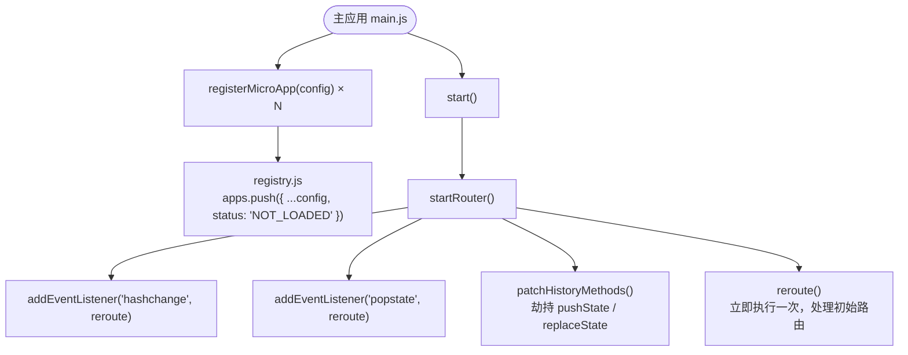
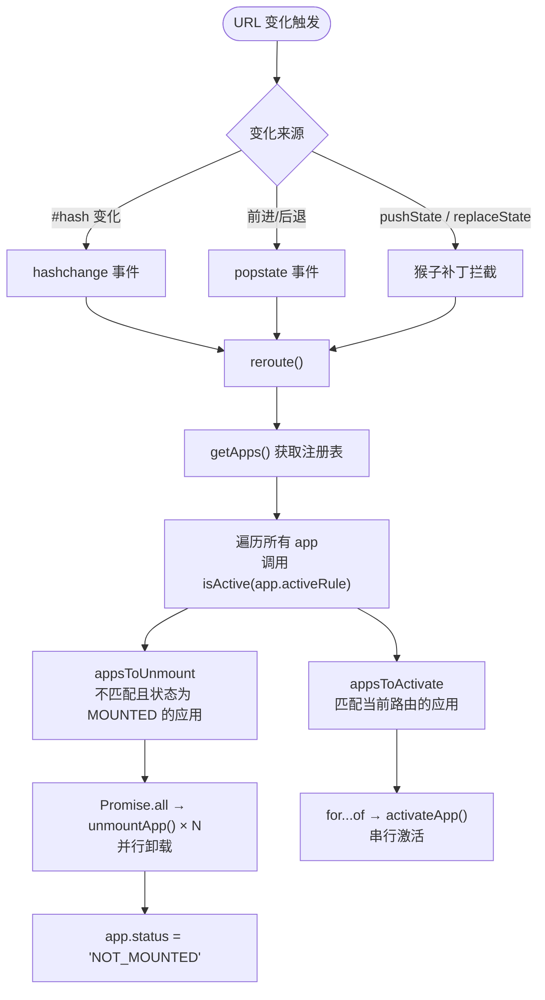
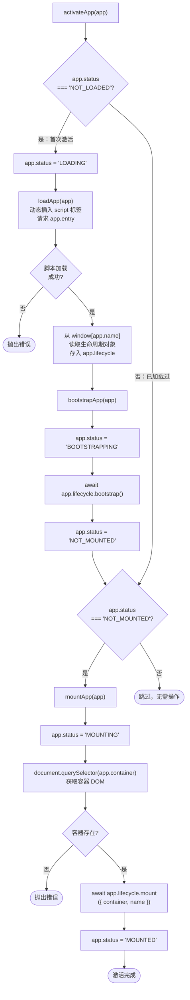
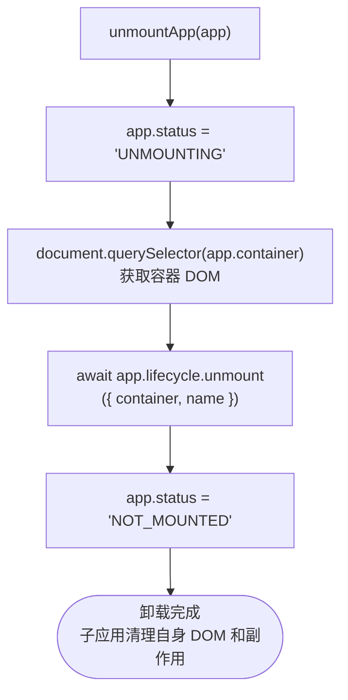
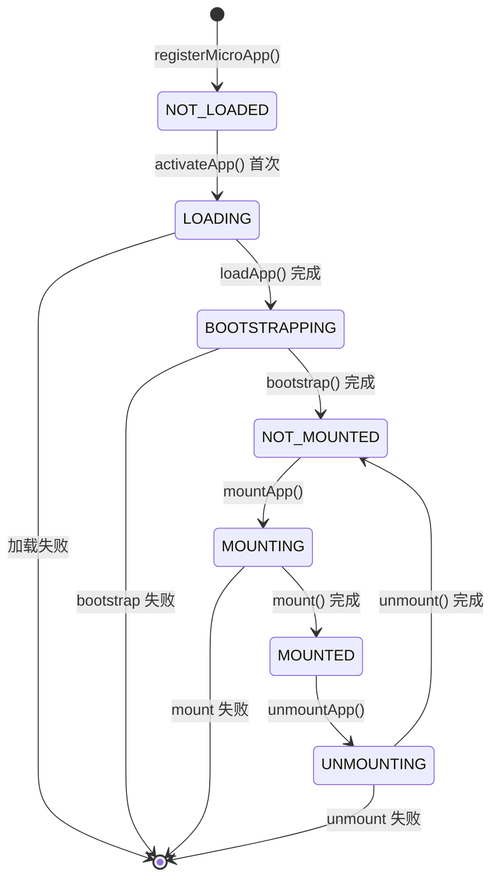
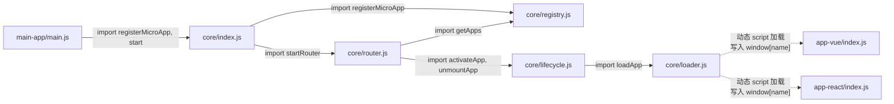

# 阶段一：微前端最小核心实现

## 模块结构

```
packages/
├── core/src/
│   ├── index.js      对外 API 入口
│   ├── registry.js   子应用注册表
│   ├── router.js     路由监听与调度
│   ├── lifecycle.js  生命周期管理
│   └── loader.js     脚本加载器
├── main-app/
│   ├── index.html    主应用页面
│   └── main.js       主应用入口
├── app-vue/
│   └── index.js      子应用 A
└── app-react/
    └── index.js      子应用 B
```

---

## 一、启动流程

主应用调用 `registerMicroApp` + `start()` 完成初始化。



---

## 二、路由变化调度流程

每次 URL 发生变化，`reroute()` 被调用，决定挂载/卸载哪些子应用。



---

## 三、子应用激活流程（activateApp）

首次激活需经历完整的加载→初始化→挂载链路；后续切回只需重新挂载。



---

## 四、子应用卸载流程（unmountApp）



---

## 五、子应用状态机



---

## 六、模块依赖关系



> 实线 = 静态 import，虚线 = 运行时动态加载
