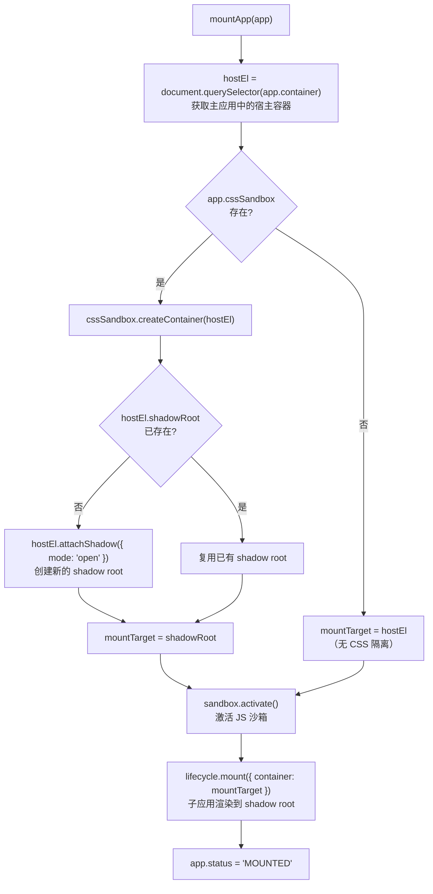
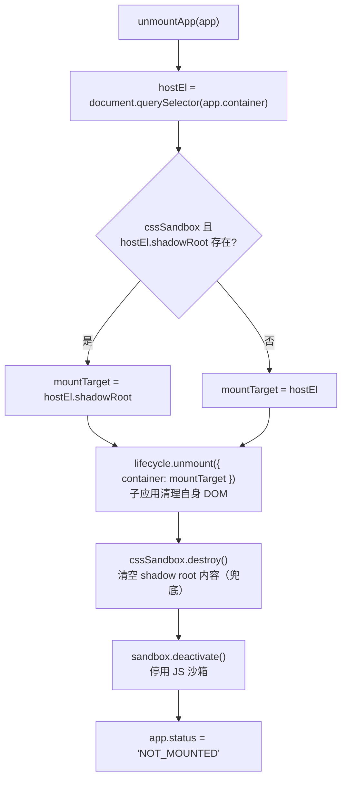
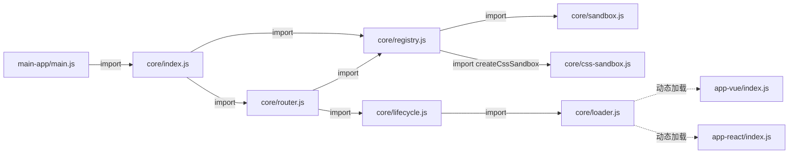

# 阶段三：CSS 隔离

## 问题背景

阶段二解决了 JavaScript 全局变量污染。但样式污染问题依然存在：

```css
/* 子应用 A 写了这条规则 */
h2 { color: green; font-size: 32px; }
```

这条规则会影响整个页面的所有 `h2`，包括主应用的导航栏标题、其他子应用的内容——这就是 CSS 污染。

---

## 两种解决方案

### 方案 A：Shadow DOM（本阶段主线）

**原理**：浏览器原生支持的 DOM 隔离机制。

每个 DOM 节点可以挂载一个独立的"影子树"（Shadow Tree），影子树内外的样式**完全隔离**：
- 外部的全局样式无法穿透进 shadow root
- 内部的样式规则不会泄漏到 shadow root 外

```
主应用 Light DOM                Shadow Tree（子应用）
┌──────────────────┐           ┌──────────────────────────────┐
│  <nav>主导航</nav> │           │  #shadow-root（隔离边界）      │
│                  │           │  ├── <style> h2{color:green} │ ← 只作用于内部
│  #app-container  │──shadow──▶│  └── <div class="app">       │
│  (宿主元素 host)  │           │       <h2>Vue 子应用</h2>     │
└──────────────────┘           └──────────────────────────────┘

主应用的 h2 { color: red } ──×──▶ 无法穿透，子应用 h2 仍为绿色 ✓
子应用的 h2 { color: green } ──×──▶ 不泄漏，主应用 h2 仍为红色 ✓
```

### 方案 B：Scoped CSS（补充实现）

**原理**：拦截子应用插入的所有 `<style>` 标签，动态给每条规则加上**属性选择器前缀**：

```css
/* 原始规则（子应用写的） */
h2 { color: green }

/* 改写后（框架自动处理） */
[data-micro-app="app-vue"] h2 { color: green }
```

同时给子应用的宿主容器加上 `data-micro-app="app-vue"` 属性，这样改写后的规则只影响该子应用的 DOM 树。

---

## 本阶段新增代码

```
packages/core/src/
└── css-sandbox.js        新增：CSS 隔离核心实现（两种模式）

修改：
  registry.js             注册时支持 cssIsolation 选项，创建 cssSandbox 实例
  lifecycle.js            mountApp/unmountApp 中接入 CSS 沙箱
  main-app/index.html     主应用增加冲突样式（h2 红色，用于演示隔离）
  app-vue/index.js        mount 时注入 <style>（h2 绿色）
  app-react/index.js      mount 时注入 <style>（h2 蓝色）
```

---

## 一、挂载流程（Shadow DOM 模式）



---

## 二、卸载流程（Shadow DOM 模式）



---

## 三、两种方案对比

| 维度 | Shadow DOM | Scoped CSS |
|------|-----------|------------|
| 隔离原理 | 浏览器原生 DOM 隔离 | 选择器命名空间隔离 |
| 隔离彻底性 | ⭐⭐⭐ 完全隔离 | ⭐⭐ 选择器级别隔离 |
| 子应用改造成本 | 无需改造 | 无需改造 |
| 全局弹窗兼容性 | ❌ 挂载到 body 的弹窗丢失样式 | ✅ 正常工作 |
| 第三方 UI 库兼容 | ❌ 可能有问题 | ✅ 基本兼容 |
| 调试体验 | 略繁琐（需展开 shadow-root） | 正常 |
| 生产环境推荐 | 新项目、强隔离场景 | 多数生产项目 |

---

## 四、Shadow DOM 的关键细节

### 1. attachShadow 只能调用一次

```js
// ❌ 同一宿主元素多次调用会报错：
// "Shadow root cannot be created on a host which already hosts a shadow tree"
hostEl.attachShadow({ mode: 'open' })
hostEl.attachShadow({ mode: 'open' })  // 报错！

// ✅ 正确做法：复用已有的 shadowRoot
const shadowRoot = hostEl.shadowRoot ?? hostEl.attachShadow({ mode: 'open' })
```

### 2. mode: 'open' vs 'closed'

```js
// open 模式：可以通过 element.shadowRoot 从外部访问（方便调试）
hostEl.attachShadow({ mode: 'open' })
console.log(hostEl.shadowRoot)  // ✅ 可访问

// closed 模式：外部无法访问（更安全，但调试困难）
hostEl.attachShadow({ mode: 'closed' })
console.log(hostEl.shadowRoot)  // null
```

### 3. 子应用必须将 DOM 和样式都插入到 shadowRoot

```js
// ✅ 正确：style 和 DOM 都在 shadowRoot 内，样式只影响 shadow tree 内部
async function mount({ container }) {  // container 是 shadowRoot
  const style = document.createElement('style')
  style.textContent = 'h2 { color: green }'
  container.appendChild(style)   // 样式隔离在 shadow 内

  const div = document.createElement('div')
  container.appendChild(div)     // DOM 也在 shadow 内
}

// ❌ 错误：将样式挂到 document.head 则无法隔离
document.head.appendChild(style)
```

---

## 五、Scoped CSS 的关键细节

### 选择器改写规则

```css
/* 原始 */                        /* 改写后 */
h2 { ... }              →   [data-micro-app="app-vue"] h2 { ... }
.btn.active { ... }     →   [data-micro-app="app-vue"] .btn.active { ... }
:root { --color: red }  →   [data-micro-app="app-vue"] { --color: red }
html, body { ... }      →   [data-micro-app="app-vue"] { ... }
```

### MutationObserver 拦截时机

```js
// Scoped 模式用 MutationObserver 监听子应用动态插入的 <style>
const observer = new MutationObserver((mutations) => {
  for (const mutation of mutations) {
    for (const node of mutation.addedNodes) {
      if (node.tagName === 'STYLE') {
        scopeStyle(node)  // 拦截并改写
      }
    }
  }
})
observer.observe(hostEl, { childList: true, subtree: true })
```

---

## 六、模块依赖关系（阶段三更新）


